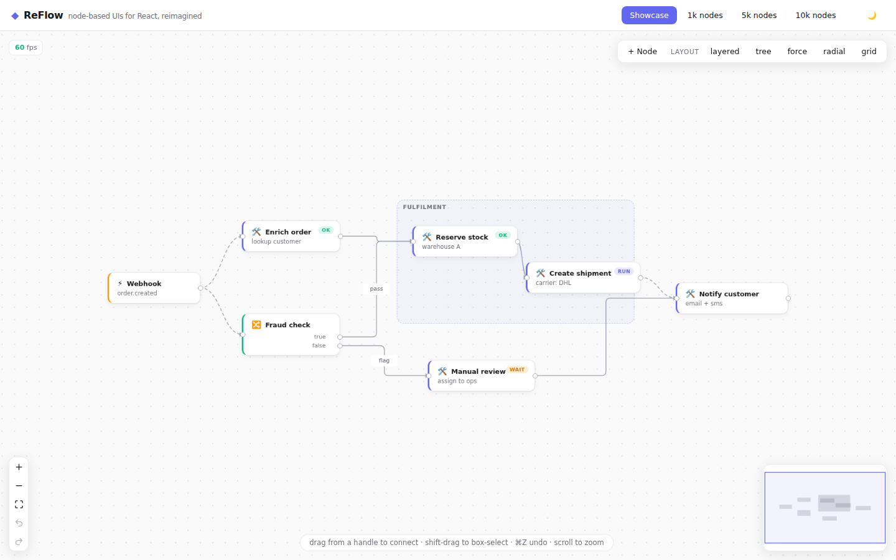
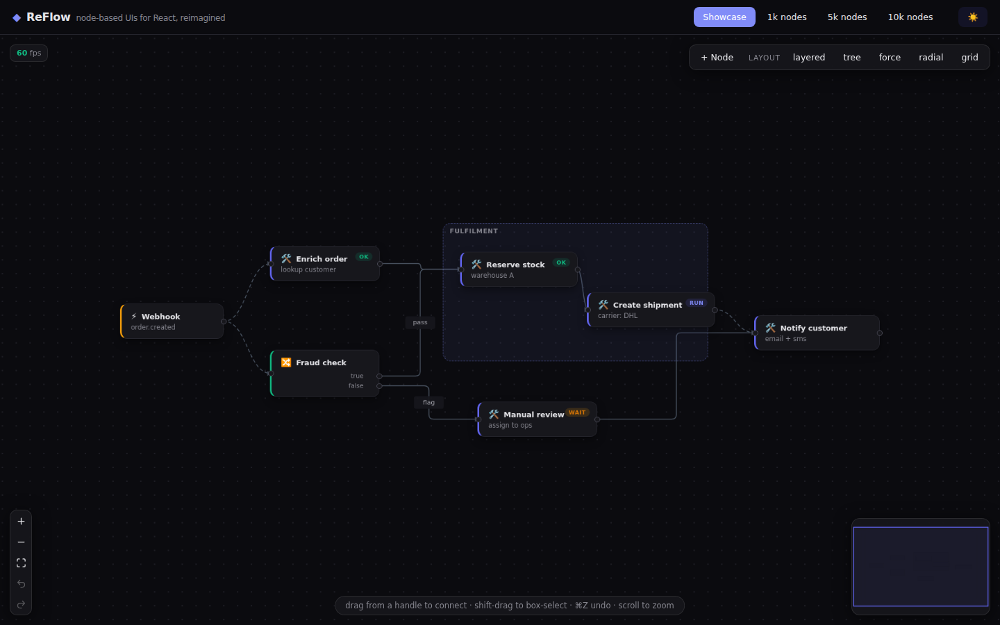
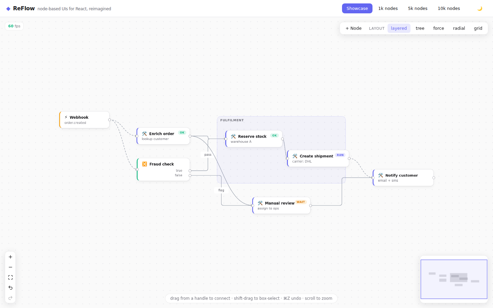

<div align="center">

# ◆ ReFlow

**Node-based UIs for React, reimagined.**

The fastest, most complete open source library for building flow editors,
workflow builders, data pipelines and node graphs with React —
with the features other libraries put behind a paywall built in and free.

[Quick start](#quick-start) · [Why ReFlow](#why-reflow) · [Features](#features) · [Docs](./docs/getting-started.md) · [Live demo](#run-the-demo)



</div>

---

## Why ReFlow

React Flow (xyflow) made node-based UIs mainstream. ReFlow starts where it
stops — every row in this table is a deliberate design decision, not an
add-on:

| | **ReFlow** | React Flow (xyflow) |
| --- | --- | --- |
| Undo / redo | ✅ Built in, transactional, drag-coalescing | 💰 Pro example, DIY |
| Auto-layout | ✅ Built in: layered, tree, force, radial, grid — zero deps | 💰 Pro example + dagre/elkjs |
| Alignment guides + snapping | ✅ Built in, Figma-style | 💰 Pro example ("helper lines") |
| Viewport culling | ✅ On by default, spatial-index backed, hysteresis | ⚠️ Opt-in, linear scan |
| Re-render on drag | ✅ Only the dragged node + its edges | ⚠️ Store-wide change dispatch |
| Pan / zoom | ✅ Direct DOM transform — **zero** React renders | ⚠️ Renders through the store |
| MiniMap | ✅ Canvas (no per-node React elements) | ⚠️ One SVG React element per node |
| Typed ports | ✅ `dataType` + `maxConnections` on handles, cycle prevention | ⚠️ Single `isValidConnection` callback |
| AI-agent integration | ✅ JSON operations + validated executor, LLM tool schema, graph→Mermaid | ❌ DIY |
| Orthogonal routing w/ obstacle avoidance | ✅ Edges route **around** nodes (A*), re-route live | ❌ Edges cross nodes |
| Real-time collaboration | ✅ Transport-agnostic CRDT-style sync + presence, Yjs-ready | ❌ DIY |
| Migration path | ✅ `@reflow/compat` — drop-in React Flow API adapter | — |
| Copy / paste / duplicate | ✅ Built in (⌘C/V/D/X), id-remapped, one undo | ⚠️ DIY |
| NodeResizer / NodeToolbar / edge reconnect | ✅ Built in | ✅ (some Pro) |
| Accessibility | ✅ Focusable nodes, aria, spatial keyboard nav | ⚠️ Partial |
| Graph algorithms | ✅ Topo sort, cycle detect, components, shortest path, ancestors | ⚠️ `getIncomers` / `getOutgoers` |
| State management | ✅ `useReflow()` — no reducers, no change handlers | ⚠️ `onNodesChange` + `applyNodeChanges` boilerplate |
| Headless core | ✅ `@reflow/core` — zero dependencies, runs anywhere | ⚠️ `@xyflow/system` (depends on d3-zoom/d3-drag) |
| Default look | ✅ Polished theme, dark mode, animations out of the box | ⚠️ Gray boxes |
| License | ✅ MIT, everything free | MIT + paid Pro examples |

**Head-to-head benchmark vs React Flow** (reproducible: `npm run bench`,
production builds, identical scenes, Chromium software rendering, every pan
verified to actually move the viewport — see [BENCHMARKS.md](./benchmarks/BENCHMARKS.md)):

| 10,000 nodes, zoomed-in editing | Pan FPS | DOM nodes | Heap |
| --- | ---: | ---: | ---: |
| **ReFlow** | **43** | **143** | **18 MB** |
| React Flow (default) | 4 | 10,000 | 239 MB |
| React Flow (`onlyRenderVisibleElements`) | 9 | 49 | 34 MB |

ReFlow culls off-screen nodes **by default** via a spatial hash index, so a
10k-node graph stays interactive while using **~13× less memory**. When every
node is genuinely on-screen (zoomed all the way out), both libraries are
paint-bound and roughly tied — ReFlow stays marginally ahead at half the
memory. Numbers are honest and reproducible, not marketing.

## Quick start

```bash
npm install @reflow/react
```

```tsx
import { ReFlow, Background, Controls, MiniMap } from '@reflow/react';
import '@reflow/react/styles.css';

const nodes = [
  { id: 'a', position: { x: 0, y: 0 }, data: { label: 'Hello' } },
  { id: 'b', position: { x: 260, y: 80 }, data: { label: 'World', description: 'it just works' } },
];
const edges = [{ id: 'e1', source: 'a', target: 'b', animated: true }];

export default function App() {
  return (
    <div style={{ width: '100vw', height: '100vh' }}>
      <ReFlow defaultNodes={nodes} defaultEdges={edges}>
        <Background />
        <Controls />
        <MiniMap />
      </ReFlow>
    </div>
  );
}
```

That's the whole app. Pan, zoom, drag, connect, box-select, delete,
**undo/redo**, alignment guides, dark mode — all already working.
No `onNodesChange`, no `applyNodeChanges`, no state wiring.

### Drive it imperatively

```tsx
import { useReflow } from '@reflow/react';

function Toolbar() {
  const flow = useReflow();
  return (
    <>
      <button onClick={() => flow.addNode({ id: crypto.randomUUID(), position: { x: 0, y: 0 }, data: { label: 'New' } })}>
        Add
      </button>
      <button onClick={() => flow.layout('layered', { duration: 300 })}>Auto layout</button>
      <button onClick={() => flow.undo()}>Undo</button>
      <button onClick={() => flow.fitView({ duration: 300 })}>Fit</button>
    </>
  );
}
```

## Features

### ⚡ Performance as architecture, not an afterthought

- **Fine-grained reactivity** — every node and edge subscribes to its own
  topic (`node:<id>`, `edge:<id>`). Dragging one node re-renders one node
  and its edges. Nothing else.
- **Zero-render pan/zoom** — the viewport transform is written straight to
  the DOM. React is not involved in a single pan frame.
- **Spatial hash culling** — only visible nodes are mounted, with overscan
  hysteresis so panning doesn't churn mounts every frame.
- **Batched measurement** — one shared `ResizeObserver`, and handle
  positions are measured in a single read-then-write pass (no layout
  thrashing when 500 nodes mount at once).
- **Canvas MiniMap** — repaints 10k nodes in about a millisecond.

### 🎨 Beautiful by default

Light and dark themes with a modern look — soft shadows, hover elevation,
selection rings, animated edges — all themeable with CSS variables
(`--rf-accent`, `--rf-node-bg`, …). `colorMode="auto"` follows the OS.



### 🧭 Built-in auto-layout (no dagre, no elkjs)

```tsx
flow.layout('layered', { direction: 'LR' }); // Sugiyama-style, handles cycles
flow.layout('tree');                          // tidy trees & forests
flow.layout('force', { linkDistance: 180 });  // deterministic (seeded) FR
flow.layout('radial');                        // BFS rings
flow.layout('grid', { columns: 8 });
```

Every layout is a single undoable transaction and knows about node sizes,
subflows and cycles.



### ↩️ Real undo/redo

Every mutation is recorded with its inverse. Drags coalesce into one entry.
Group anything with `flow.transact('label', () => { ... })`. `⌘Z` / `⌘⇧Z`
work out of the box, and `useHistory()` gives you reactive
`canUndo`/`canRedo` for your own UI.

### 🔌 Typed, validated connections

```tsx
<Handle kind="source" side="right" dataType="tensor" maxConnections={1} />
```

Incompatible types can't connect. Full handles are rejected. Set
`preventCycles` and edges that would create a loop are refused — validated
live while dragging, with the connection line turning red.

### 📐 Figma-style alignment guides

Drag a node near another's edge or center: guide lines appear and the node
snaps. On by default (`alignmentGuides={false}` to disable), plus optional
`snapGrid`.

### 🧩 Custom everything

```tsx
function MetricNode({ data, selected }: NodeProps<{ kpi: string }>) {
  return (
    <div className={selected ? 'ring' : ''}>
      <Handle kind="target" side="left" />
      {data.kpi}
      <Handle kind="source" side="right" />
    </div>
  );
}
<ReFlow nodeTypes={{ metric: MetricNode }} … />
```

Handles are measured automatically — put them anywhere in your markup and
edges anchor exactly. Custom edges get precomputed geometry
(`path`, `labelX/Y`, endpoints) as props.

### 🤖 Built for the AI era

An LLM can drive the canvas through a validated JSON operation format —
with a ready-made tool schema and prompt fragment:

```ts
import { applyOperations, operationSchema, OPERATIONS_PROMPT, describeGraph, toMermaid } from '@reflow/core';

// agent emits ops via tool-calling…
applyOperations(flow.store, [
  { op: 'add_node', id: 'retry', label: 'Retry (3x)' },
  { op: 'connect', source: 'fetch', target: 'retry' },
  { op: 'set_status', id: 'fetch', status: 'running', message: 'batch 4/12' },
]); // never throws — errors are collected; one batch = one ⌘Z

describeGraph(store); // compact JSON for the model's context
toMermaid(store);     // or Mermaid — the cheapest tokens you'll spend
```

Auto-layout places position-less nodes, `set_status` animates live
execution, and the same zero-dependency engine validates agent output
server-side before it reaches a client. See the **AI copilot** demo tab and
[docs/ai-integration.md](./docs/ai-integration.md).

### 🗂 Subflows & groups

`parentId` nests nodes; children move with their parent for free (one
transform, not N re-renders). `extent: 'parent'` clamps children inside.
Deleting a group re-parents children instead of orphaning them.

### 🧠 A real graph library underneath

```ts
import { topologicalSort, hasCycle, connectedComponents, shortestPath,
         getAncestors, getDescendants, getIncomers, getOutgoers } from '@reflow/core';
```

`@reflow/core` is headless and dependency-free — use it in Node.js for
server-side validation, tests, or CLI tooling with the exact engine the UI
runs.

### And also

Controlled *or* uncontrolled modes · box selection · keyboard shortcuts
(delete, select-all, arrow-nudge) · edge labels & markers · animated edges ·
`bezier` / `smoothstep` / `step` / `straight` paths · MiniMap
drag-to-navigate · `fitView`/`centerNode` with smooth animation ·
save/restore snapshots · SSR-safe · touch support with two-finger pinch
zoom · `panOnScroll` trackpad mode (Figma-style) · level-of-detail
rendering when zoomed out · works with Tailwind, shadcn/ui, Radix, Base UI,
MUI ([integration guide](./docs/integrations.md)).

### 🔄 Migrating from React Flow?

`@reflow/compat` is a drop-in adapter — change your imports and an existing
React Flow app runs on ReFlow's engine (undo/redo and culling included, free):

```diff
- import { ReactFlow, Handle, Position, useReactFlow } from '@xyflow/react';
+ import { ReactFlow, Handle, Position, useReactFlow } from '@reflow/compat';
```

`useNodesState`, `onNodesChange`/`applyNodeChanges`, `onConnect`, custom
`nodeTypes`, `<Handle type position>` all keep working. See
[docs/migration.md](./docs/migration.md).

## Packages

| Package | What it is |
| --- | --- |
| [`@reflow/core`](./packages/core) | Headless engine: store, spatial index, paths, layouts, history, algorithms, AI ops. Zero dependencies. |
| [`@reflow/react`](./packages/react) | React renderer: `<ReFlow>`, components, hooks, theme. Depends only on core + React. |
| [`@reflow/compat`](./packages/compat) | React Flow (xyflow) API compatibility adapter for migrations. |

## Honesty

Every performance claim here is backed by a reproducible benchmark, and
every feature by a passing test. [CLAIMS.md](./CLAIMS.md) is a line-by-line
audit of this README against the code; [PROGRESS.md](./PROGRESS.md) tracks
what's done vs. what's still open. The one honestly-open item labelled as
such: a *live* Anthropic-API AI demo (the JSON operation layer it calls is
fully fuzz-tested — only the keyed round-trip is unwired). The UI-frameworks
demo tab is built on the **real** shadcn/ui (Radix) and Base UI packages, and
cross-browser E2E plus visual-regression snapshots run in CI.

## Run the demo

```bash
git clone https://github.com/olbboy/reflow && cd reflow
npm install
npm run dev   # showcase + 1k/5k/10k stress scenes at http://localhost:5173
```

## Development

```bash
npm run build      # build core + react (compat: npm run build -w @reflow/compat)
npm test           # 132 unit/integration tests (vitest)
npm run typecheck  # strict TS across packages
npm run test:e2e   # cross-browser E2E: Chromium/Firefox/WebKit + touch (Playwright)
npm run test:e2e:visual  # visual-regression snapshots (Chromium, pinned baselines)
npm run bench      # reproducible head-to-head benchmark vs React Flow
```

## Documentation

- [Getting started](./docs/getting-started.md)
- [Custom nodes & edges](./docs/custom-nodes.md)
- [Auto-layout: built-in, incremental, off-thread](./docs/layout.md)
- [Real-time collaboration (+ Yjs)](./docs/collaboration.md)
- [AI agent integration](./docs/ai-integration.md)
- [Migrating from React Flow](./docs/migration.md)
- [Tailwind / shadcn / Radix / Base UI](./docs/integrations.md)
- [Performance guide](./docs/performance.md)
- [Core concepts & API](./docs/api.md)

**Interactive examples:** `npm run dev:docs` — a live gallery (basic flow,
custom nodes, auto-layout, smart routing, AI ops, collaboration) with source
shown side-by-side.

## License

[MIT](./LICENSE) — every feature above is free, forever.
